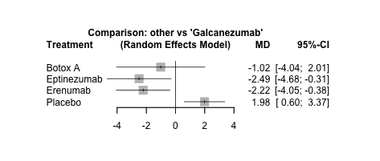

# 👋 Hi, I'm Meha Patel

I'm a data scientist and statistician passionate about solving real-world problems using machine learning and analytics.  
Welcome to my portfolio!

---

## 💼 Featured Projects

### 🔹 Network Meta Analysis on Chronic Migraine Treatments
Performed Network Meta Analysis to ompare the efficacy of Galcanezumab versus key comparators in reducing monthly migraine days in
patients with chronic migraine.

**Tools:** R, Rmd, netmeta, LaTex, EDA  
**Highlights:**
- Rank treatments based on relative effectiveness using network-derived estimates.
- Assess the certainty of evidence supporting treatment comparisons through the evaluation of network
consistency and heterogeneity

  

**Results:** From the forest plot comparing all treatments versus Galcanezumab (random effects model), we can conclude that Galcanezumab demonstrated statistically significant superiority only versus placebo. All active treatments achieved reductions exceeding the 2-day threshold generally considered clinically meaningful for chronic migraine prevention.
📊 [GitHub Repo](https://github.com/mehapatell/Network-Meta-Analysis)  
📄 [Final Report (PDF)](assets/NMA_Meha_Patel.pdf)  

---

### 🔹 mu-Imputed mSCD for Missing Data
Co-authored publication in SIURO on a novel technique for solving linear syst,  mems with missing data.  
**Tech:** MATLAB, Linear Algebra, Optimization  
📄 [Read Paper](chrome-extension://efaidnbmnnnibpcajpcglclefindmkaj/https://www.siam.org/media/ecvhfw2t/s159201r.pdf)

---

### 🔹 Obesity Level Classification
Built a feedforward neural network to classify obesity levels from eating and lifestyle habits.  
**Tech:** Python, Scikit-learn, Keras  
➡️ [Project Repo](https://github.com/mehapatell/obesity-classification)

---

## 📄 Resume  
[Download Resume (PDF)](resume.pdf)
